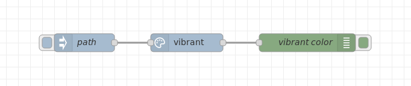

# This repo has been archived.

---

[](https://nodei.co/npm/node-red-contrib-vibrant/)

# Node-RED vibrant node

A node for Node-RED that extract color palette, i.e. prominent colors from an image.



## Usage

Simply drag node `vibrant` from dashboard palette to your flow. Node expects local path or remote URL of an image from which you want to extract prominent colors. Node perform several validation and then sends payload with raw output from `node-vibrant` library. In output you can find several swatches (`Vibrant`, `Muted`, `DarkVibrant`, `DarkMuted`, `LightVibrant` and `LightMuted`), each one with fields `r`, `g`, `b`, `rgb`, `hex`, `hsl`, `population`, `titleTextColor`, `bodyTextColor`. 

## Build

If you want to modify and build changes, then you must recompile from TypeScript sources with command:

```
$ npm run build
```

Pull requests are welcome!

# Thanks to

Authors of used libraries, especially author of <a href="https://www.npmjs.com/package/node-vibrant">node-vibrant</a>.

# Author

## Lukas Novak

[](http://www.novaklukas.cz)

Freelance full-stack software developer based in Olomouc, Czech Republic. I focus on mobile apps with Kotlin and application servers in Node.js. As a hobby, I experiment with voice assistants and build my smart home. See my [personal web page](http://www.novaklukas.cz) (in Czech) or blog on [Medium](https://medium.com/@novalu)
